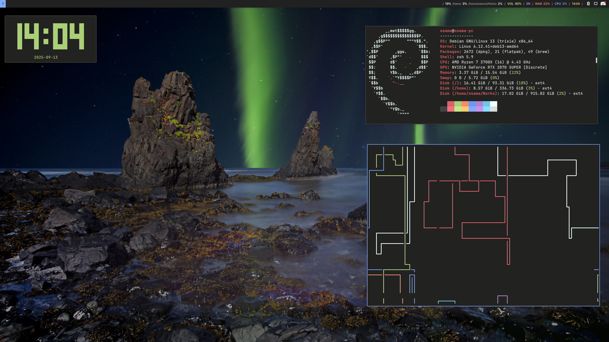
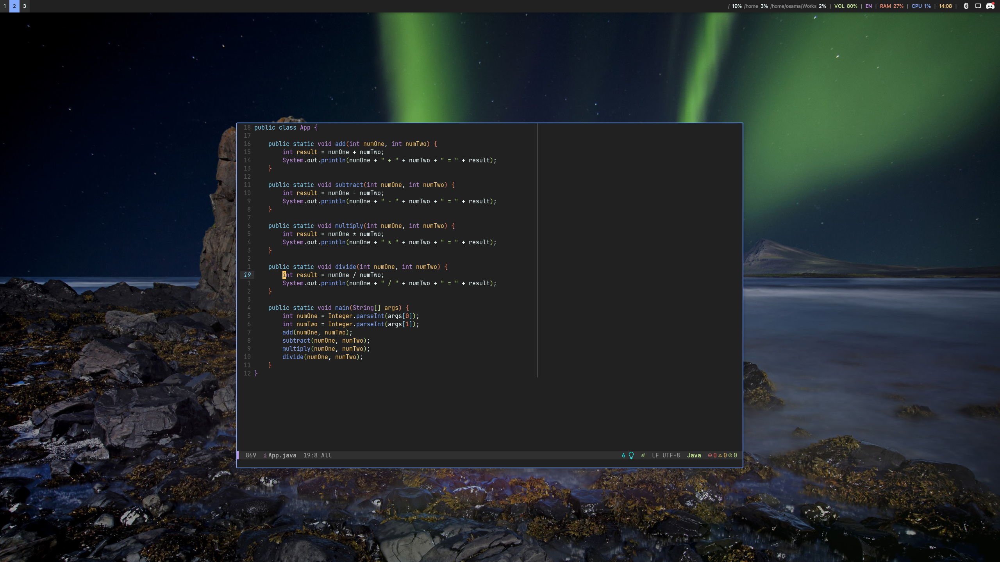

Material i3
======
***this config is not supposed to work except my machine.***

# this i3wm dotfiles need these:
- [Apple fonts](https://developer.apple.com/fonts/)
- Polybar for panel
- Rofi for app menu
- Picom for animations and rounded corners
- Kitty the terminal

# Screenshots

